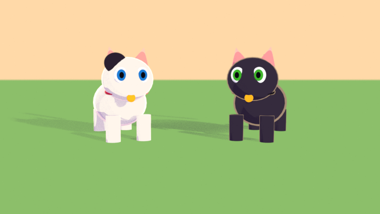

# design/blender: Blender recipes and helpers (v1.1, toon look)
Everything here was **tested headless with Blender's Python module (bpy 5.0.1, EEVEE software GL)** on toon placeholder characters: the scripts build, light, rig and render. Real Meshy models are untested (none exist yet). Targets **Blender 4.2 LTS or newer** (5.x works; engine name is auto-detected).

| File | What |
|---|---|
| `SETUP.md` | Install, project layout, import a Meshy GLB, clean-up, run the helpers, **first shot in 10 minutes** |
| `SHADING.md` | Toon material recipe (node by node) + the one-line script version |
| `LIGHTING_AND_CAMERAS.md` | Golden-hour rig, variants, camera presets 16:9 + 9:16, safe areas, DOF notes |
| `RIGGING.md` | Quadruped armature, naming contract, shape keys (blink/expressions/visemes), lip-sync, tiers, the rig script |
| `example_placeholder_render.png`, `example_rigged_closeup.png` | What the pipeline outputs today with placeholder characters |

Code: `pipeline/blender/` → `build_shot.py` (shot runner), `rig_quadruped.py` (rig), `qa_model.py` (model checks), `evg/` (palette, toon, lights, cameras, characters, scene).

